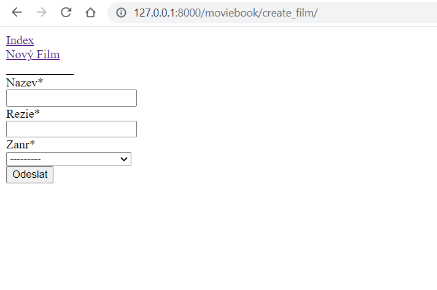

# MOVIEBOOK

One of the first applications I did while studying. It is a really simple app, that allows you to add movies and set the director and genre for them. 

## The app is built with:
* Python
* Django
* SQLite
* HTML
* Git

## Printscreens of application

